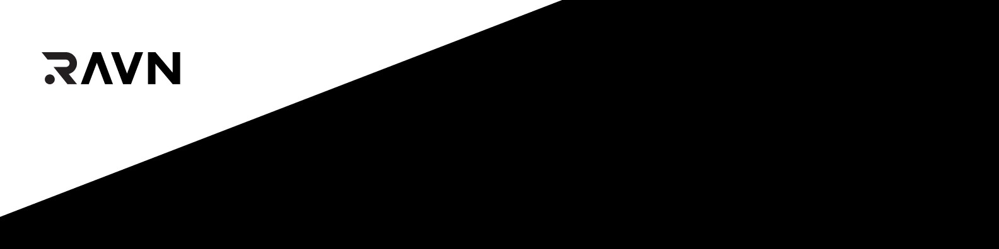
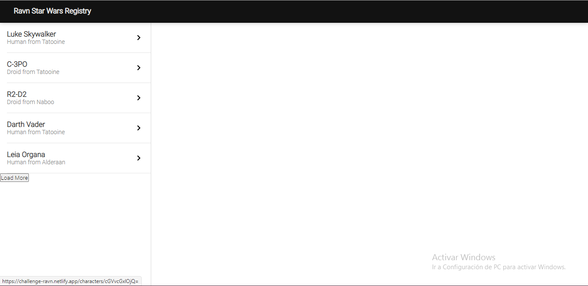
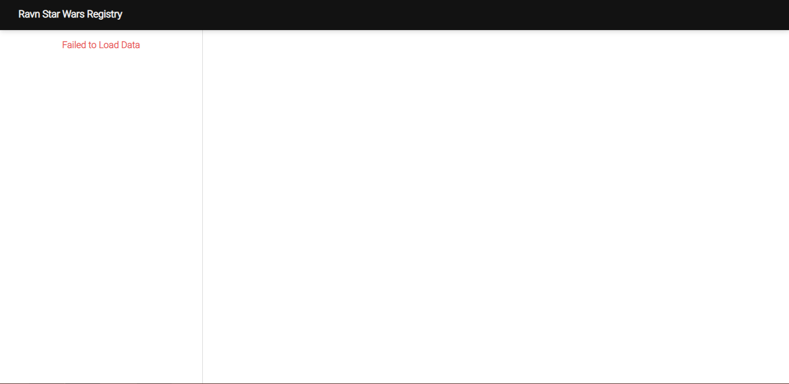
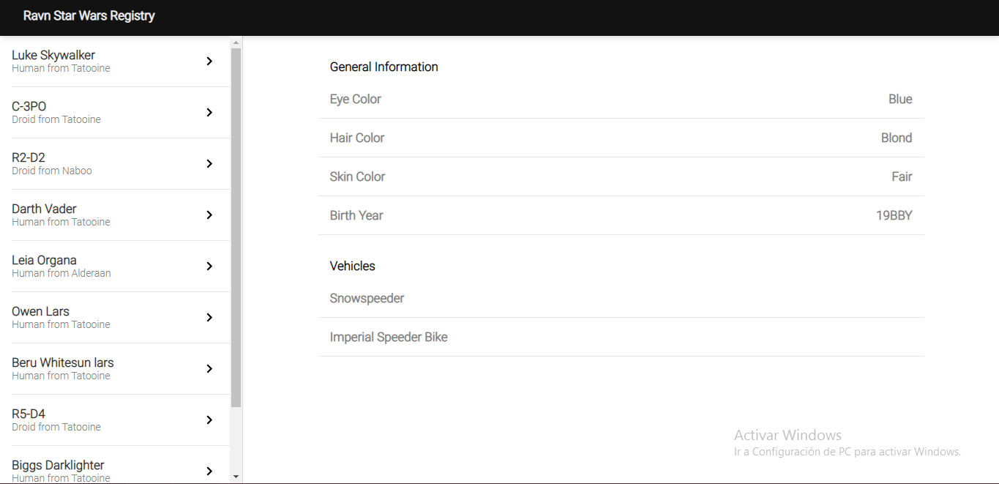

## ravn - swapi

by: Sandra Maria Zapata Quentasi https://challenge-ravn.netlify.app/



### Get Started

1. Clone the repository in any directory on your computer and enter the created folder
   ```
   $ git clone  https://github.com/szapataq/Ravn-Challenge-V2-Sandra_Zapata.git
   $ cd Ravn-Challenge-V2-Sandra_Zapata
   ```
2. Install dependencies with:
   ```
   $ npm install
   ```
3. Run the project
   ```
   $ npm start
   ```

### Technologies used

- Graphql
- Apollo client
- React
- Sass

### Views

- Initial View
  

- Loading View
  

- Loading View
  

- Detail View
  
